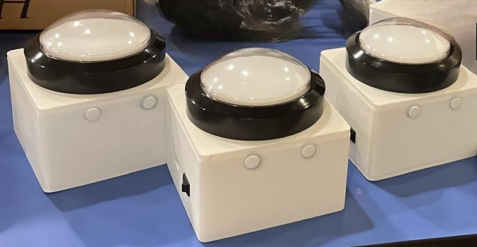

## 🔔 Wireless Buzzer System

A compact and reliable wireless buzzer system built using ESP32-C3, tailored for competitive quiz settings.
Designed for simplicity, affordability, and fast response tracking with up to 5 players,
this system highlights who buzzed in first — all displayed through a GUI.

Created for better accommodating interactive icebreaker sessions and quiz games for missionary trips in
Chiang Rai, Thailand.

Supported by the [**Charis Evangelical Free Church**](https://www.charisefc.org.sg/).



## ✨ Features

#### 🔧 Custom-built Hardware – Designed using ESP32-C3 with lithium-ion batteries

#### 📶 Wi-Fi Communication – Reliable 1 master ↔ 5 slave setup (20m line of sight)

#### 🧠 Fastest Responder Logic – Master determines the first signal received

#### 💻 Desktop GUI – Shows buzzer order & triggers a win animation

#### 🧩 3D-Printed Cases – Collaborative design finalized across iterations

#### 💸 Low Cost – ~$30 per complete buzzer device

## 🛠️ Tech Stack

| Category      | Tools Used                                                                                                        |
| ------------- | ----------------------------------------------------------------------------------------------------------------- |
| Hardware      | Seeed Studio Xiao Beetle ESP32-C3, 100mm Arcade Buttons, WS2812B 5V LED,<br>Lithium-Ion Battery 3400mAH, 3D Print |
| Firmware      | C++ with ESP-NOW                                                                                                  |
| Communication | Peer-to-Peer communication through ESP-NOW Wi-Fi stack                                                            |
| Diplay App    | Simple desktop GUI (e.g. Python + dearpygui + zmq)                                                                |
| Tools         | PlatformIO, Fusion360 (for CAD) Git                                                                               |

## 🧪 How It Works

### 📡 System Overview

The system consists of **five wireless buzzers** (based on Seeed Studio Xiao Beetle ESP32-C3)
and **one master controller**, communicating over Wi-Fi. A **desktop GUI** handles visual display
and control through USB serial connection to the master controller.

### 🔄 Application Flow

#### 1. Startup & Registration (SETUP MODE)

- Buttons are turned on manually and wait for acknowledgment (ACK) from the controller.
- Once acknowledged, the buzzer lights up and blinks, and registration is reflected on the GUI.
- PC GUI shows button connection statuses and can trigger the switch to GAME MODE once any
  number of buttons are registered.

#### 2. Gameplay (GAME MODE)

- When ready, the host presses **RESET** on the GUI to prepare for a new round.
- Players press their buzzer as fast as they can.
- The controller determines the first valid press and sends the result to the GUI.
- GUI plays an animation (MP4) corresponding to the winning button.

### 📶 Communication Modes

Option 1 (Current)

- All devices use Wi-Fi STA mode
- Pros: Lower power consumption
- Cons: Button MAC addresses are hardcoded in the controller

Option 2 (Planned/Flexible)

- Buttons act as Wi-Fi AP, controller scans
- Pros: No need to hardcode MACs
- Cons: Slightly higher power usage

### 🔋 Button Device

- Powered by lithium-ion battery
- On boot, attempts connection and waits for ACK
- Upon successful press and ACK:
  - LED blinks to confirm registration
  - Master notifies PC app of readiness
- ESP-NOW handles basic collision handling using a back-off strategy if multiple buttons
  press at the same time

### 🖥️ Controller ↔ PC Interface

- Communicates with the GUI via USB serial (pySerial)
- Responsibilities:
  - Tracks registered buttons during setup
  - Sends winner data during gameplay
  - Receives commands (e.g. RESET, START GAME)

### 🧩 GUI Interface

- Shows each button's status (connected, pressed)
- Displays winner information
- Triggers MP4 animation per button ID from a configurable file path
- Sends RESET commands to controller and updates all button LEDs accordingly

## 🗂️ Project Structure

```bash
wireless_buzzer_system/
├── code/
│ ├── buzzer_button/ # Slave ESP32 firmware (C++ + ESPHome)
│ ├── buzzer_controller/ # Master ESP32 firmware (C++ + ESPHome)
│ ├── buzzer_gui/ # PC GUI display logic
│ └── Instruction.txt # Instructions for how to set up the system
├── pcb/ # Electronic schematic and PCB design files
├── case/ # 3D printable STL files
├── assets/ # Images
└── README.md
```

## 📝 Development Notes

- Built in ~1 month as a two-person team:
  - Hardware + firmware: primary focus (me)
  - Enclosure design + assembly: partner
- Fairness tuning not implemented due to time constraint (players are within similar distances)
- System tuned for simplicity and practical use over perfection

## 📘 References

- [ESPNOW](https://docs.espressif.com/projects/esp-idf/en/stable/esp32/api-reference/network/esp_now.html)
- [Example of using espnow with buttons](https://github.com/makermoekoe/Picoclick-C3/tree/main/code/Picoclick_C3)
- [How to Create A Sports Button](https://www.youtube.com/watch?v=HAt3EoVqO7I)
- [Seeed Xiao ESP32-C3 Schematic](https://wiki.seeedstudio.com/XIAO_ESP32C3_Getting_Started/)
